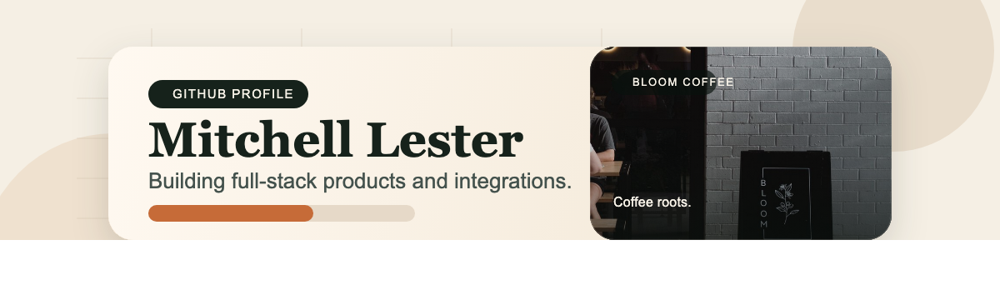

<p align="center">
  
</p>

<p align="center">
  
  
  
</p>

## About

I’m Mitchell Lester, a full stack developer currently working at me&u and building side projects through Bloom Coffee Industries.

I’ve spent the last 5+ years building full stack products across hospitality, property, and drone technology. My work spans front-end and back-end development, with a focus on TypeScript, JavaScript, Angular, React, Java, Spring Boot, Django, REST APIs, and user-centered product development.

Most of my recent work lives in private repositories, so this profile is a compact snapshot of the stack, domains, and kinds of systems I work on.

## What I Work On

- Full stack product development across web apps, internal tools, and APIs
- Front-end work in Angular and React with TypeScript-first codebases
- Back-end services in Java and Spring Boot, plus integration-heavy product work
- Mobile and cross-platform work with React Native and Flutter where it fits

## Current Focus

- Senior Software Engineer at me&u
- Building side projects through Bloom Coffee Industries
- Shipping practical product features with strong UX, maintainable code, and clean integrations

## How I Build

- Keep products simple for the user and maintainable for the team
- Prefer clear architecture and readable code over cleverness
- Build around real workflows, not just clean demos
- Care about delivery speed without letting quality drift

## Selected Experience

- me&u — Senior Software Engineer
- Department 13 — built secure Java services and REST APIs connecting front-end systems to hardware
- OrderMate — worked across POS software, Java web services, React, and payments including Adyen
- Zango Canberra — shipped React, Django, and React Native work across web and mobile
- Digital Docket Display — built with Flutter and Firebase, integrated with Square POS, and released to the App Store and Google Play

## Current Toolkit

```text
Angular • React • TypeScript • JavaScript • Java
Spring Boot • Django • React Native • Flutter • Firebase
REST APIs • third-party integrations • product engineering
```

## Worth Talking About

- Full stack product engineering
- Angular, React, TypeScript, Java, Spring Boot, and Django
- POS, payments, APIs, and third-party integrations
- Building software while also growing side projects
