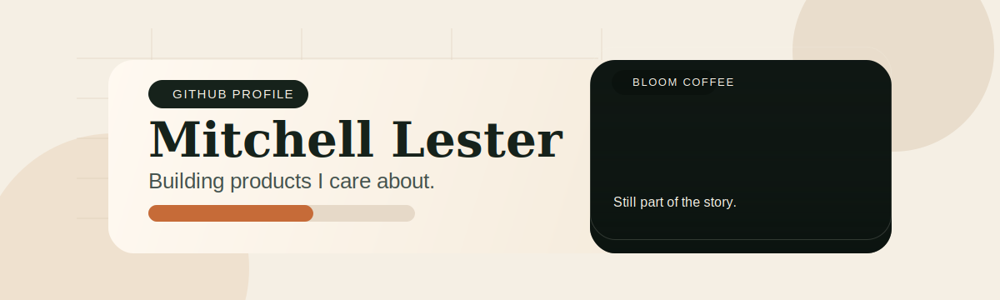

<p align="center">
  
</p>

<p align="center">
  
  
  
</p>

## About Me

I build practical systems for automation, AI agents, and operator-facing products.

Most of my current work lives in private repos, so this profile is the simplest snapshot of what I care about: calm interfaces, visible work, and automation that stays understandable when the stakes go up.

## What I Work On

- AI agent workflows with clear controls, approval points, and readable work logs
- Product systems that help founders and operators move faster without losing context
- Infrastructure and tooling that favor reliability, auditability, and sane defaults

## How I Like To Build

- Ship fast, but keep the system legible
- Prefer reversible decisions over clever lock-in
- Design for real operators, not demo-only flows

## Current Toolkit

```text
TypeScript • Next.js • Fastify • Prisma • Supabase
Redis • GitHub Actions • Railway • MCP integrations
Automation • observability • product systems
```

## Open To

- AI agent infrastructure and automation conversations
- Product engineering work with strong operational constraints
- Collaborating with teams that care about clarity, safety, and execution
